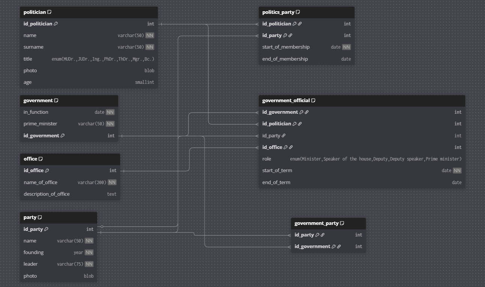

# Politika - Rétorika

Tento SQL dump obsahuje částečně naplněnou relační databázi, která mapuje **české vlády, ministry, politické strany a politiky** od roku 2010 až do současnosti (prosinec 2025).

## Přehled tabulek a jejich účel

| Tabulka                | Popis
|--------------------------|-------------------------------------------------------------|
| `government`             | Seznam vlád podle data jmenování a premiéra (6 vlád)
| `government_official`    | Kdo v které vládě zastával jakou funkci a v jakém období
| `government_party`       | Které strany byly součástí které vlády (koaliční strany)
| `office`                 | Seznam ministerstev a úřadů (15 položek vč. „Vláda“)
| `party`                  | Politické strany (10 nejvýznamnějších současných stran)
| `politician`             | Konkrétní politici (8 osob, převážně současní lídři a ministři)
| `politics_party`         | Historie členství politiků ve stranách (vč. změn stran)

## Chronologický přehled vlád (tabulka `government`)

| ID | Datum jmenování   | Premiér            | Poznámka
|----|-------------------|--------------------|------------------------------------
| 1  2010-07-28      | Petr Nečas         | pravicová koalice ODS–TOP 09–LIDEM
| 2  2013-10-06      | Jiří Rusnok        | úřednická vláda
| 3  2014-01-29      | Bohuslav Sobotka   | ČSSD–ANO–KDU-ČSL
| 4  2017-12-13      | Andrej Babiš       | menšinová vláda ANO
| 5  2018-06-27      | Andrej Babiš       | druhá vláda ANO+ČSSD (s podporou KSČM)
| 6  2021-12-17      | Petr Fiala         | koalice SPOLU (ODS+KDU-ČSL+TOP 09) + Piráti+STAN ← **současná vláda**

## Současná vláda Petra Fialy (od 17. 12. 2021)

### Koaliční strany
- ODS
- KDU-ČSL
- TOP 09
- Piráti
- STAN

### Zástupci ve vládě (podle dumpu – pouze část ministrů je uvedena)
| Politik             | Strana | Funkce                     | Ministerstvo / úřad
|---------------------|--------|----------------------------|------------------------------
| Petr Fiala          | ODS    | premiér                    | Vláda
| Vít Rakušan         | STAN   | ministr vnitra             | Ministerstvo vnitra
| Jan Lipavský        | ODS    | ministr zahraničí          | Ministerstvo zahraničních věcí

## Významní politici v databázi

| ID | Jméno               | Titul | Věk | Hlavní strana (aktuálně)
|----|---------------------|-------|-----|-------------------------------
| 1  | Andrej Babiš        | Ing.  | 71  | ANO 2011 (předseda)
| 2  | Petr Fiala          | PhDr. | 61  | ODS (předseda a premiér)
| 5  | Alena Schillerová   | JUDr. | 61  | ANO 2011 (exministryně financí)
| 6  | Karel Havlíček      | Ing.  | 56  | ANO 2011
| 7  | Vít Rakušan         | Mgr.  | 47  | STAN (předseda a ministr vnitra)
| 8  | Jan Lipavský        | Bc.   | 40  | 2015–2024 Piráti → 2025 ODS

→ Zajímavost: Jan Lipavský v roce 2025 přestoupil z Pirátů do ODS (data k 1. 1. 2025).

## Politické strany v databázi

| ID | Název strany                  | Založení | Současný předseda/lídr
|----|-------------------------------|----------|--------------------------|
| 1  | Občanská demokratická strana  | 1991     | Petr Fiala
| 2  | ANO 2011                      | 2012     | Andrej Babiš
| 3  | Strana přímé demokracie (SPD) | 2015     | Tomio Okamura
| 4  | STAROSTOVÉ A NEZÁVISLÍ (STAN) | 2004     | Vít Rakušan
| 5  | Česká pirátská strana         | 2009     | Zdeněk Hřib
| 6  | TOP 09                        | 2009     | Matěj Ondřej Havel
| 7  | KDU-ČSL                       | 1919     | Marek Výborný
| 10 | SOC-DEM (dříve ČSSD)          | 1878/1993| Jana Maláčová

## Shrnutí hlavních faktů z dumpu

- Databáze pokrývá období 2010–2025 (včetně současné Fialovy vlády).
- Obsahuje pouze **vybrané** politiky a ministry (celkem 8 osob), nikoliv kompletní seznam.
- Jsou zaneseny i historické změny (např. dva záznamy pro Babišovu vládu, přestup Lipavského).
- Všechny tabulky mají správné cizí klíče a indexy pro rychlé vyhledávání.

## Reference modelu - https://dbdiagram.io/d/politics-690c52366735e11170821d22

